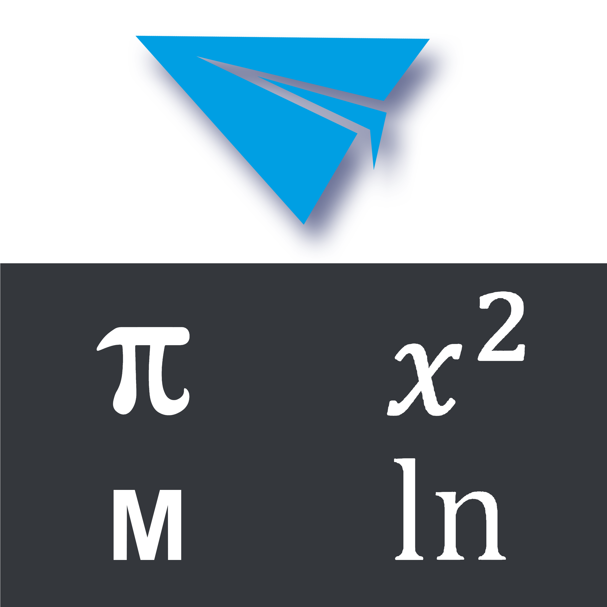
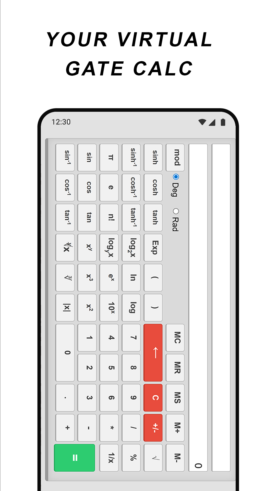
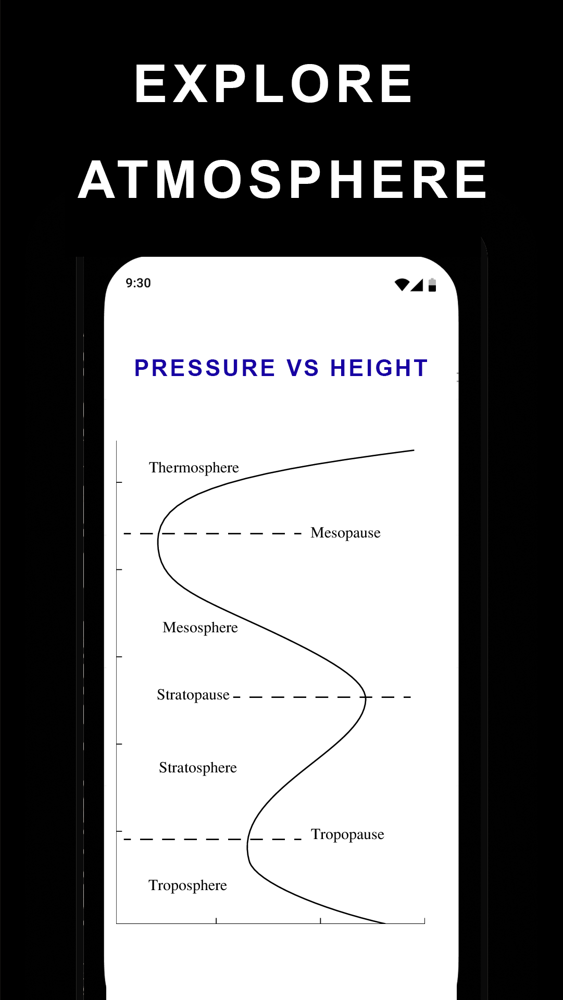

# Aero_Calc_App    

# 📱 Aero Calc

This app provides a user-friendly GATE calculator and scientific calculator designed to simplify complex calculations, with a special focus on  aerospace engineering and advanced science applications.


## 🚀 ABOUT AERO_CALC_API
**Aero Calc Gate**  Powered by AERO_CALC_API to perform all Basic,standard calculation of aerospace.

---

## ✨ Features
-  **Feature 1** – Unit Conversion  
-  **Feature 2** – Compressible Flow Equations 
-  **Feature 3** – Atmosphere Calculations
-  **Feature 4** – Gate Calculator 

---

## 🖼 Screenshots
| Home Screen | Feature Screen | Settings |
|-------------|---------------|----------|
|  |  |  |

---

## 🛠 Tech Stack
- **Frontend:** Android Studio / Java / Simple HTML-CSS-JS 
- **Backend:** js / Gate Calc / json
- **API** Developing OWN API, for Wide Range of Variety of Units Conversion scaling.
---

### API DOCUMENTATION

```
      calculateThrust(velocity,massflow)
      calculateAirMach(velocity,Temperature)
      tocgs()
      toSI()
      toP2-p1()

```
<iframe src="./source/atm.html" width="800" height="500" />

## 📥 App Link

[AERO CALC APP](https://play.google.com/store/apps/details?id=com.mugiwara.jarvis&reviewId=0)
    <span class="icon">⭐</span>
      Rate AERO CALC
      <span>Play Store — Leave a review</span>
    